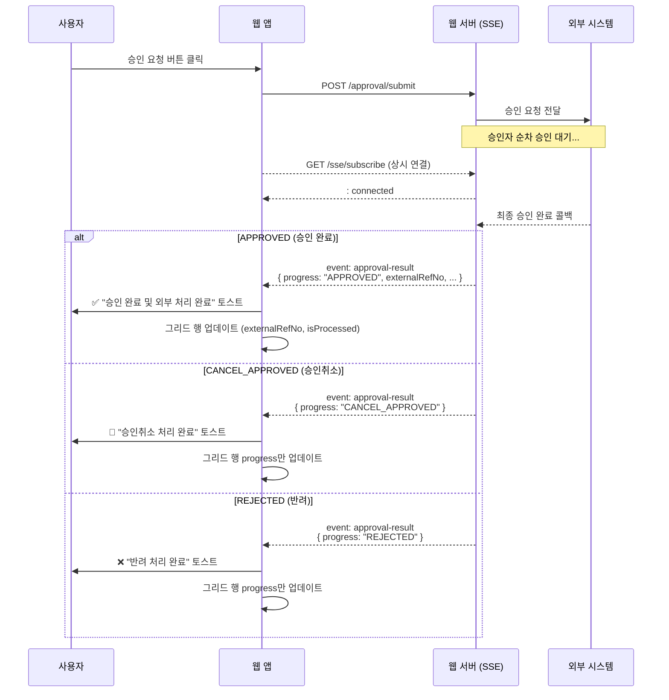

> 웹앱에서 승인 요청을 보내면 외부 시스템이 처리하고, 처리 결과를 SSE로 실시간 수신한다

## 개요

일반적인 HTTP 요청은 요청-응답이 즉시 끝나지만, 외부 시스템의 처리는 수 초~수십 초가 걸릴 수 있다.
이때 **SSE(Server-Sent Events)** 를 사용하면 서버가 처리 완료 시점에 클라이언트로 단방향 푸시가 가능하다.

**전체 흐름:**
```
사용자 → 승인 요청(REST) → 웹 서버 → 외부 시스템 처리
                                              ↓ (비동기 완료)
사용자 ← SSE 이벤트 수신 ← 웹 서버 ← 처리 결과 콜백
```

---

## SSE 기초

### WebSocket vs SSE

| 항목 | WebSocket | SSE |
|------|-----------|-----|
| 방향 | 양방향 | 단방향 (서버→클라이언트) |
| 프로토콜 | ws:// | HTTP |
| 자동 재연결 | ❌ 직접 구현 | ✅ 브라우저 내장 |
| 용도 | 채팅, 게임 | 알림, 피드, 진행상황 |

SSE는 HTTP 위에서 동작하므로 기존 인증(쿠키, 헤더)을 그대로 사용할 수 있어 알림 시스템에 적합하다.

### EventSource API

```typescript
const es = new EventSource('/api/sse/subscribe?userId=1234')

// 기본 메시지
es.onmessage = (e) => console.log(e.data)

// 커스텀 이벤트명
es.addEventListener('approval-result', (e: MessageEvent) => {
  const data = JSON.parse(e.data)
  console.log(data)
})

es.onerror = () => {
  es.close()
  // 재연결 로직
}
```

---

## Vite에서 SSE Mock 설정

개발 환경에서 백엔드 없이 SSE를 테스트하려면 `vite.config.ts`의 `server.middlewares`를 활용한다.

```typescript
// vite.config.ts
import { defineConfig } from 'vite'
import react from '@vitejs/plugin-react'

export default defineConfig({
  plugins: [react()],
  server: {
    port: 3000,
    middlewares: [
      (req, res, next) => {
        if (req.url?.startsWith('/api/sse/subscribe')) {
          // SSE 헤더 설정
          res.writeHead(200, {
            'Content-Type': 'text/event-stream',
            'Cache-Control': 'no-cache',
            'Connection': 'keep-alive',
            'Access-Control-Allow-Origin': '*',
          })

          // 연결 확인용 초기 메시지
          res.write(': connected\n\n')

          // 3초 후 mock 이벤트 전송
          const timer = setTimeout(() => {
            const mockData = {
              id: 'req-001',
              orderNo: 'ORD2024001',
              year: '2024',
              externalRefNo: 'EXT-9999',
              status: 'SUCCESS',
              progress: 'APPROVED',
            }
            res.write(`event: approval-result\n`)
            res.write(`data: ${JSON.stringify(mockData)}\n\n`)
          }, 3000)

          // 클라이언트 연결 종료 시 정리
          req.on('close', () => {
            clearTimeout(timer)
            res.end()
          })
        } else {
          next()
        }
      },
    ],
  },
})
```

**핵심 포인트:**
- `event: {이름}\n` → 커스텀 이벤트명 지정
- `data: {내용}\n\n` → `\n\n` (개행 2번)이 메시지 종료 신호
- `keep-alive` 헤더로 연결 유지

---

## 프론트엔드 훅 구현

### 이벤트 타입 정의

```typescript
// progress: 외부 시스템 처리 결과 구분
export interface ApprovalResultEvent {
  id: string          // 요청 ID (그리드 row 키)
  orderNo: string     // 내부 주문번호
  year: string        // 기준 연도
  externalRefNo: string  // 외부 시스템 참조번호
  status: string      // 'SUCCESS' | 'FAILED'
  errmsg?: string     // 실패 시 오류 메시지
  progress: 'APPROVED' | 'CANCEL_APPROVED' | 'REJECTED'
}
```

### 커스텀 훅

```typescript
export const useSseNotification = (onResult: (data: ApprovalResultEvent) => void) => {
  const userId = useAtomValue(sessionAtom)?.userId
  const callbackRef = useRef(onResult)
  callbackRef.current = onResult  // 최신 콜백 유지 (재구독 방지)

  const [modalState, setModalState] = useState({ opened: false, docNo: '', year: '' })

  useEffect(() => {
    if (!userId) return

    let retryCount = 0
    let eventSource: EventSource | null = null
    let retryTimer: ReturnType<typeof setTimeout> | null = null

    const connect = () => {
      eventSource = new EventSource(`/api/sse/subscribe?userId=${userId}`)

      eventSource.addEventListener('approval-result', (e: MessageEvent) => {
        const data: ApprovalResultEvent = JSON.parse(e.data)

        // 토스트 표시
        showApprovalToast(data, openModal)

        // 페이지 콜백 호출
        callbackRef.current(data)
      })

      eventSource.onopen = () => { retryCount = 0 }

      eventSource.onerror = () => {
        eventSource?.close()
        if (retryCount < 5) {
          retryCount++
          retryTimer = setTimeout(connect, 3000)  // 3초 후 재연결
        }
      }
    }

    connect()

    return () => {
      eventSource?.close()
      if (retryTimer) clearTimeout(retryTimer)
    }
  }, [userId])  // userId가 바뀔 때만 재구독

  return { modalState, openModal, closeModal }
}
```

**`callbackRef` 패턴을 쓰는 이유:**
- `useEffect` 내부의 `connect()`가 한 번만 실행되어야 함 (재구독 방지)
- 그런데 `onResult` 콜백이 매 렌더마다 새 참조가 됨
- ref에 담으면 항상 최신 콜백을 참조하면서도 `connect()`는 재실행되지 않음

---

## progress별 처리 분기

### 토스트 메시지

```typescript
const getToastTitle = (data: ApprovalResultEvent, isError: boolean) => {
  switch (data.progress) {
    case 'APPROVED':      return isError ? '외부 시스템 전송 실패' : '승인 완료 및 외부 처리 완료'
    case 'CANCEL_APPROVED': return '승인취소 처리 완료'
    case 'REJECTED':      return '반려 처리 완료'
  }
}
```

### 그리드 업데이트

```typescript
useSseNotification((data) => {
  const instance = gridRef.current?.instance()
  const items = instance?.getDataSource()?.items()
  const rowIndex = items?.findIndex((item) => item.id === data.id)
  if (rowIndex === undefined || rowIndex < 0) return

  // progress에 따라 업데이트할 필드가 다름
  const updateData = data.progress === 'APPROVED'
    ? { orderNo: data.orderNo, externalRefNo: data.externalRefNo, isProcessed: true, progress: data.progress }
    : { progress: data.progress }  // 승인취소/반려는 progress만

  instance?.getDataSource()?.store()?.push([{ type: 'update', key: data.id, data: updateData }])
  instance?.repaintRows([rowIndex])
})
```

---

## 전체 흐름 다이어그램



---

## 재연결 전략

브라우저의 `EventSource`는 자동 재연결을 지원하지만, 커스텀 제어가 필요할 때 직접 구현한다.

```
연결 끊김 (onerror)
    ↓
retryCount < 5 ?
    ↓ YES                    ↓ NO
3초 후 재연결            재연결 포기 (사용자에게 알림 필요)
retryCount++
```

**주의:** `onerror`는 연결이 끊겼을 때뿐 아니라 서버가 응답하기 전에도 발생할 수 있으므로, `onopen`에서 `retryCount = 0` 리셋이 중요하다.

---

## 관련 개념
- WebSocket — 양방향이 필요한 경우 대안
- Long Polling — SSE 이전의 실시간 구현 방식
- React Query + Optimistic Update — 그리드 즉시 반영 패턴
- Vite `server.middlewares` — 개발 환경 mock API 구성
