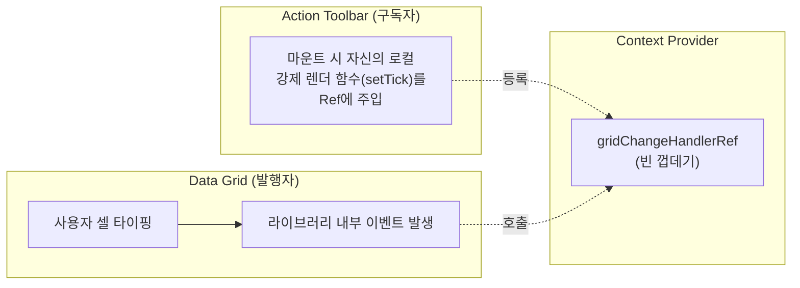

실무 프로젝트에서 복잡한 UI, 특히 데이터 그리드의 일괄 편집(Bulk Edit) 기능을 구현하며 겪었던 상태 관리 및 렌더링 최적화 이슈와, 이를 해결하기 위해 React의 **Context API** 및 **`useRef` 콜백 패턴**을 적용한 과정을 정리한 개발 노트입니다. 후반부에는 같은 화면에서 wrapper 하나 때문에 발생한 성능 저하 트러블슈팅도 함께 다룹니다.

## 1. 전역 상태 관리: 왜 Context API를 도입했는가?

데이터 그리드의 일괄 편집(Bulk Edit) 기능을 구현할 때, 편집 모드 상태(`isEditMode`)나 변경된 데이터의 스냅샷(`snapshotRef`)을 여러 계층의 컴포넌트가 공유해야 했습니다.

- **문제 상황 (Prop Drilling 지옥)**: Context 없이 상태를 관리하면, 최상위 페이지 컴포넌트에서 상태를 들고 있어야 합니다. 이 상태를 실제 사용하는 '그리드'나 '툴바'까지 내리기 위해 중간 단계의 컴포넌트들에게 불필요한 props를 계속 넘겨줘야 하는 구조적 결함이 발생합니다.

- **해결 (Context Provider)**: `Context`를 도입하여 전역 데이터 창고(Provider)를 만들었습니다. 이제 최상위에서 상태를 한 번만 제공하면, 자식 컴포넌트들은 트리 깊이에 상관없이 `useContext` 훅으로 필요한 데이터만 뽑아서 쓸 수 있게 되었습니다.

- **주의할 점 (상태 리셋 조건)**: Provider 컴포넌트가 화면에서 사라지면(Unmount) 그 안에서 관리되던 state와 ref 값은 모두 메모리에서 날아갑니다(초기화). 조건부 렌더링이나 라우트 이동 시 편집 상태가 풀리는 것이 바로 이 생명주기 때문입니다.

## 2. 렌더링 최적화: useRef를 활용한 콜백 전달 패턴

이번 작업에서 마주친 가장 까다로운 성능 이슈는 **"외부 라이브러리의 내부 상태 변경을 React에게 어떻게 효율적으로 알릴 것인가?"**였습니다.

### 배경 문제 (전체 페이지 리렌더링 이슈)

- 사용자가 데이터 그리드의 셀을 편집하면, 외부 그리드 라이브러리(예: DevExtreme, AG Grid 등)는 React의 `useState`가 아닌 **자기 자신만의 내부 상태(`editing.changes`)**에 데이터를 쌓습니다. 따라서 React는 사용자가 타이핑을 해도 리렌더링을 트리거하지 않습니다.

- 하지만 상단의 **'액션 툴바(Action Toolbar)'**는 변경사항이 생길 때마다 "저장" 버튼을 활성화하기 위해 리렌더링이 꼭 필요했습니다.

- 이전에는 최상위 페이지 컴포넌트에 강제 렌더링용 상태(`setTick` 등)를 두고 그리드에서 타이핑할 때마다 호출했는데, 이로 인해 **변경과 상관없는 전체 페이지가 매번 리렌더링**되는 성능 저하가 발생했습니다.

### 해결 방식: Context + Ref Callback

이 문제를 해결하기 위해 Context 내부에 상태(`state`) 대신 참조(`ref`)를 하나 두고, 이를 통해 콜백 함수를 연결하는 패턴을 사용했습니다.



1. **Context에 Ref 등록**: Provider에 `gridChangeHandlerRef`라는 이름의 빈 ref를 생성합니다.

2. **구독 (Toolbar)**: '툴바' 컴포넌트는 마운트될 때 자신만 리렌더링시킬 수 있는 로컬 함수(`handleOptionChanged`)를 `ref.current`에 넣어둡니다.

3. **발행 (Grid)**: '그리드' 컴포넌트에서 편집 이벤트가 발생하면, `gridChangeHandlerRef.current?.(e)`를 호출하여 툴바가 넣어둔 함수를 원격으로 실행시킵니다.

4. **결과 (최적화 성공)**: 라이브러리 상태가 변할 때, **전체 페이지나 그리드는 가만히 있고 오직 '툴바' 컴포넌트만 깔끔하게 리렌더링**됩니다.

### 왜 State나 Props 대신 Ref를 사용했는가?

만약 저 콜백 함수를 Context의 `useState`로 등록했다면, 콜백이 등록되거나 갱신되는 순간 Provider 전체가 리렌더링되면서 하위 컴포넌트들이 또다시 렌더링의 늪에 빠집니다. **`useRef`는 값이 바뀌어도 리렌더링을 유발하지 않는다는 핵심 특성**이 있습니다. 따라서 툴바가 콜백을 등록하는 행위 자체가 Grid나 Provider를 전혀 건드리지 않고 조용히 연결 고리만 만들어 줄 수 있었습니다.

### 구현 코드 구조 (추상화 버전)

위 개념들을 종합하여 실제로 적용한 커스텀 훅과 Context 구조입니다.

```typescript
import React, { createContext, useContext, useState, useRef, useCallback } from 'react';

// 1. Context 생성
const GridEditContext = createContext<any>(null);

// 2. Provider: 상태와 Ref를 보관
export const GridEditProvider = ({ children }) => {
  const [isEditMode, setIsEditMode] = useState(false); // 편집 모드 상태
  const snapshotRef = useRef(new Map()); // 원본 데이터 스냅샷 (리렌더 무관)

  // 핵심 최적화: 외부 이벤트를 특정 컴포넌트에만 전달하기 위한 콜백 Ref
  const gridChangeHandlerRef = useRef<((e: any) => void) | undefined>(undefined);

  return (
    <GridEditContext.Provider value={{ isEditMode, setIsEditMode, snapshotRef, gridChangeHandlerRef }}>
      {children}
    </GridEditContext.Provider>
  );
};

// 3. Toolbar 컴포넌트 (리렌더링 타겟)
const ActionToolbar = () => {
  const { isEditMode, gridChangeHandlerRef } = useContext(GridEditContext);
  const [tick, setTick] = useState(0); // 툴바 전용 강제 리렌더링 트리거

  React.useEffect(() => {
    // 툴바가 마운트되면, 자신의 로컬 렌더링 함수를 전역 Ref에 등록 (리렌더 유발 X)
    gridChangeHandlerRef.current = (e) => {
      console.log("그리드 데이터 변경 감지!");
      setTick(prev => prev + 1); // 툴바만 리렌더링
    };
  }, []);

  return (
    <div>
      <button>저장 (렌더링 횟수: {tick})</button>
    </div>
  );
};

// 4. Grid 컴포넌트 (이벤트 발생지)
const DataGrid = () => {
  const { gridChangeHandlerRef } = useContext(GridEditContext);

  const handleLibraryInternalChange = (e) => {
    // 라이브러리 내부 편집 발생 시, 툴바가 등록해둔 함수를 원격 호출
    gridChangeHandlerRef.current?.(e);
  };

  return (
    <div onEdit={handleLibraryInternalChange}>
      {/* 실제 그리드 라이브러리 컴포넌트 */}
    </div>
  );
};
```

---

## 3. 트러블슈팅: Box wrapper + LoadingOverlay 패턴이 만든 성능 저하

상태 관리 구조를 정리한 뒤에도 체감 성능이 이상했습니다. 이번에는 그리드를 감싼 wrapper가 문제였습니다.

### 문제 상황

편집 모드 전환 시 로딩 오버레이를 보여주기 위해 `Box pos="relative"` + `LoadingOverlay` 조합을 그리드에 씌웠더니 페이지가 눈에 띄게 느려졌습니다.

```tsx
<Box pos="relative">
  <LoadingOverlay visible={isTransitioning} />
  <DataGrid ... />
</Box>
```

### 원인 분석

#### 1. `Box pos="relative"` — ResizeObserver 재계산

DevExtreme DataGrid는 내부적으로 **ResizeObserver**를 사용해 컨테이너 크기 변화를 감지한다. 크기가 바뀌면 컬럼 너비를 재계산하고 grid를 repaint한다.

`position: relative` div를 그리드 바깥에 추가하면:
- 브라우저 layout 트리에서 새로운 containing block이 생성됨
- DevExtreme의 ResizeObserver가 컨테이너 변화로 인식할 수 있음
- **editMode와 무관하게 항상 존재하는 overhead**

#### 2. Context 구독 — 불필요한 re-render

`isTransitioning`을 Context에 넣고 Grid 컴포넌트에서 구독하게 했다.

```ts
// Grid에서
const { editMode, isTransitioning, gridRef } = useGridEditContext()
```

편집 모드 전환 시 흐름:
1. `setIsTransitioning(true)` 호출
2. Context 값 변경 → Grid 컴포넌트 re-render
3. `onLayoutSettled` 콜백에서 `setIsTransitioning(false)` 호출
4. 다시 Grid re-render

**편집 모드 전환 1회에 Grid가 2번 추가로 re-render.**

#### 3. React StrictMode 이중 실행 — 페이지 로드 시 spurious 트리거

`useRef`로 첫 번째 effect 실행을 skip하는 패턴을 사용했다.

```ts
const isFirstRunRef = useRef(true)
useEffect(() => {
  if (isFirstRunRef.current) {
    isFirstRunRef.current = false
    return
  }
  setIsTransitioning(true)
  setLayoutTick((prev) => prev + 1)
}, [editMode])
```

**문제:** React StrictMode는 dev 환경에서 컴포넌트를 mount → unmount → remount 한다. `useRef`는 이 사이클에서 값이 **유지**되기 때문에:

| 실행 순서 | ref 값 | 동작 |
|---|---|---|
| 첫 번째 mount | `true` | `false`로 변경 후 early return ✓ |
| StrictMode unmount | — | — |
| 두 번째 mount | `false` (유지됨!) | `setIsTransitioning(true)` 실행 ❌ |

→ 페이지를 처음 열었을 때부터 Loading overlay가 한 번 뜨고, 레이아웃이 불필요하게 재적용된다.

### 핵심 교훈

**DevExtreme DataGrid에 wrapper div를 씌울 때 주의**

DevExtreme은 컨테이너 DOM을 직접 관찰한다. `position: relative`, `overflow: hidden` 같은 속성이 있는 wrapper는 ResizeObserver 동작에 영향을 줄 수 있다.

> DevExtreme DataGrid 주변에 레이아웃 목적 이외의 wrapper div를 추가할 때는 성능 영향을 먼저 검토한다.

**Context에 넣는 값은 구독자를 고려한다**

Context 값이 바뀌면 그 값을 구독하는 모든 컴포넌트가 re-render된다. 무거운 컴포넌트(DataGrid)가 불필요한 Context 값을 구독하지 않도록 설계한다.

```ts
// ❌ Grid가 transitioning 상태까지 알 필요 없음
const { editMode, isTransitioning, gridRef } = useContext(...)

// ✅ Grid는 편집 모드 여부만 알면 됨
const { editMode, gridRef } = useContext(...)
```

**`useRef` + StrictMode 조합 주의**

"첫 번째 effect 실행 skip" 패턴은 StrictMode에서 의도대로 동작하지 않는다.

```ts
// ⚠️ StrictMode에서 두 번째 mount 시 ref가 이미 false → skip 실패
const isFirstRef = useRef(true)
useEffect(() => {
  if (isFirstRef.current) { isFirstRef.current = false; return }
  doSomething()
}, [dep])
```

StrictMode의 double-invoke는 **production 동작과 dev 동작이 다를 수 있다는 신호**다. 이 패턴이 필요하다면 설계 자체를 다시 검토하는 것이 낫다.

---

## 4. 정리

성능 저하는 세 가지 문제가 겹쳐서 발생했습니다.

| 원인 | 영향 | 발생 시점 |
|---|---|---|
| `Box pos="relative"` wrapper | ResizeObserver 재계산, grid repaint | 항상 |
| `isTransitioning` 구독 | Grid re-render 2회 추가 | 편집 모드 전환 시 |
| StrictMode + useRef 패턴 | spurious 트리거 | 페이지 로드 시 (dev) |

개별로는 작은 문제처럼 보여도 **무거운 컴포넌트 위에 쌓이면 체감 성능 저하**로 이어집니다.

결국 두 이야기는 같은 결론으로 모입니다. `useRef`는 리렌더를 유발하지 않아 Context에서 강력한 최적화 수단이 되지만(2장), 그 특성 때문에 StrictMode에서는 예상과 다르게 동작합니다(3장). 그리고 무거운 서드파티 컴포넌트 주변에서는 Context 구독 범위와 DOM 구조 모두가 성능 변수라는 점을 기억해야 합니다.
